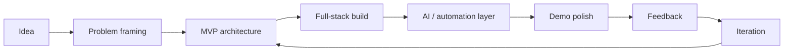

<br clear="both">

<div align="center">

[](https://github.com/krishrathi1)

<br/>

<a href="https://github.com/krishrathi1">
  
</a>
<a href="https://github.com/krishrathi1">
  
</a>

</div>

---


## About Me

```ts
class KrishRathi extends Developer {
    name       = "Krish Rathi";
    base       = "BML Munjal University, India";
    focus      = ["Full-Stack Web", "AI/ML", "Generative AI", "Workflow Automation"];
    builds     = ["Chatbots", "EdTech SaaS", "AI-powered platforms", "Agentic workflows"];
    languages  = ["Java", "Python", "C++", "C", "JavaScript", "TypeScript", "SQL"];
    dsa        = { platforms: ["LeetCode", "GeeksforGeeks"], mindset: "consistency > noise" };
    superpower = "Turning hackathon chaos into clean, working products";

    currently() {
        return [
            "shipping AI-first web products",
            "building smarter chatbot and automation systems",
            "strengthening DSA and backend fundamentals",
            "learning by competing, iterating, and launching"
        ];
    }

    connect() {
        return "linkedin.com/in/krish-rathi-036222293";
    }
}

export default new KrishRathi();
```

---


---

## Tech Arsenal

<div align="center">

**Languages**


<br/><br/>

**Frontend**


<br/><br/>

**Backend, Database, Cloud**


<br/><br/>

**AI, ML, Automation**


<br/><br/>


<br/><br/>

**Tools**


</div>

---

## Signature Builds

> Real problems. Fast prototypes. Serious polish.

---

### AI Chatbot Systems

> Conversational products that turn messy user intent into useful actions.

Built around LLMs, API calls, workflow logic, and human-friendly interfaces. This is where my full-stack work and AI curiosity meet the most.

```txt
STATUS : ACTIVE BUILD AREA
FOCUS  : chatbots, AI assistants, prompt flows, tool-connected UX
STACK  : React / Next.js / Node.js / Python / LLM APIs / Firebase
```

[](https://github.com/krishrathi1?tab=repositories)

---

<table>
<tr>
<td width="50%" valign="top">

### EdTech SaaS Platforms

> Learning products that make education feel more personal, trackable, and intelligent.

I enjoy building software that helps students, teachers, and learners move from confusion to clarity through dashboards, AI support, and smoother workflows.

```txt
STATUS : BUILT / ITERATING
FOCUS  : dashboards, AI learning flows, student-first UX
STACK  : Next.js / React / Firebase / Node.js / AI APIs
```

[](https://github.com/krishrathi1?tab=repositories)

</td>
<td width="50%" valign="top">

### Agentic Workflow Automation

> Systems that reduce manual work by connecting models, tools, and triggers.

From n8n-style automations to LLM-based decision flows, I like building pipelines that can observe, decide, and act with minimal friction.

```txt
STATUS : EXPERIMENTING + SHIPPING
FOCUS  : agents, workflows, API chaining, automation logic
STACK  : n8n / Node.js / Python / Gemini / Cohere / Together AI
```

[](https://github.com/krishrathi1?tab=repositories)

</td>
</tr>
</table>

---

## Hackathon Wall

<div align="center">

| Result | Event |
|---|---|
| Winner | Blostem Hackathon 2026 |
| Winner | IIT Ropar Hackathon Innovation 2025 |
| 3rd Prize | AI Agentic Hackathon by Swafinix Technologies |
| 3rd Prize | U Hack 4.0 |
| 4th Prize | Amity University App Innovation Challenge |
| Top 25 | Google 30-Hour Agentic Hackathon |
| Finalist | LNMIIT Jaipur Hackathon |

</div>

---


<br/><br/>

<div align="center">


<br/><br/>

<a href="https://github.com/krishrathi1">
  
</a>

</div>

---

## DSA Grind

<div align="center">

<a href="https://leetcode.com/u/krishrathi/">
  
</a>

<br/><br/>

[](https://leetcode.com/u/krishrathi/)
[](https://www.geeksforgeeks.org/profile/krishrathi)
[](https://github.com/krishrathi1)

</div>

---

## System Architecture Of How I Build



---

## Contribution Arcade

<picture>
  <source media="(prefers-color-scheme: dark)" srcset="https://raw.githubusercontent.com/krishrathi1/krishrathi1/output/pacman-contribution-graph-dark.svg">
  <source media="(prefers-color-scheme: light)" srcset="https://raw.githubusercontent.com/krishrathi1/krishrathi1/output/pacman-contribution-graph.svg">
  
</picture>

---

## Find Me

<div align="center">

<a href="https://www.linkedin.com/in/krish-rathi-036222293/">
  
</a>
&nbsp;
<a href="https://github.com/krishrathi1">
  
</a>
&nbsp;
<a href="https://leetcode.com/u/krishrathi/">
  
</a>
&nbsp;
<a href="https://www.geeksforgeeks.org/profile/krishrathi">
  
</a>

</div>

---


